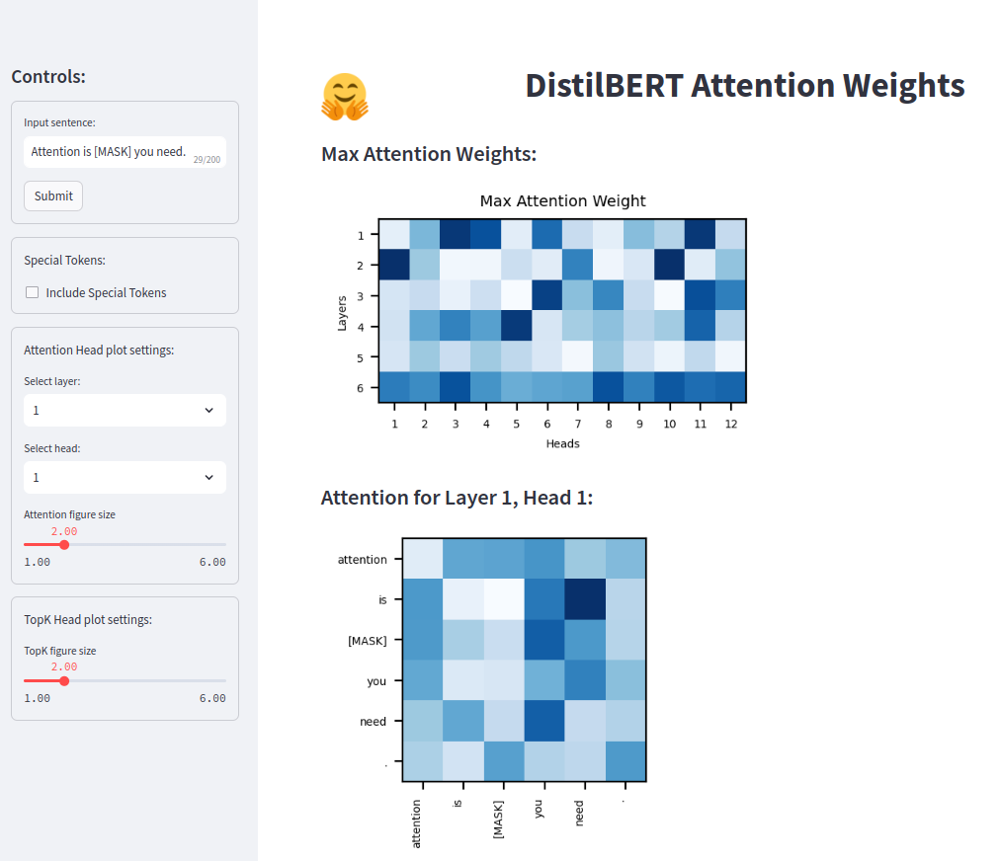

# BERT Attention Visualization

This project provides a web application for visualizing attention weights generated by DistillBERT model. It allows users to input text, select layers and heads, and visualize the attention weights in various formats.

<div align="center">
  
</div>

## Live Demo
**App at Streamlit Community Cloud:** https://bertattentionviz.streamlit.app/

## Features

- Visualize attention weights for each layer and head.
- Exclude special tokens from visualization.
- Plot top predictions for masked tokens.
- Customizable figure sizes for visualizations.
- User-friendly interface with Streamlit.

## Getting Started

To run the application locally, follow these steps:

1. Clone the repository:

   ```bash
   git clone https://github.com/insdout/bert-attention-viz.git
   ```

2. Navigate to the project directory:

   ```bash
   cd bert-attention-viz
   ```

3. Install the required dependencies:

   ```bash
   pip install -r requirements.txt
   ```

4. Run the Streamlit app:

   ```bash
   streamlit run streamlit_app.py
   ```

5. Access the app in your web browser at `http://localhost:8501`.

## Usage

- Input a sentence in the text box.
- Select layers and heads for attention visualization.
- Toggle special tokens inclusion.
- Adjust figure sizes for better visualization.
- Click "Submit" to see the attention plots.

## Contributing

Contributions are welcome! If you'd like to contribute to this project, please follow these steps:

1. Fork the repository.
2. Create a new branch (`git checkout -b feature/new-feature`).
3. Make your changes.
4. Commit your changes (`git commit -am 'Add new feature'`).
5. Push to the branch (`git push origin feature/new-feature`).
6. Create a new Pull Request.

## License

This project is licensed under the MIT License - see the [LICENSE](LICENSE) file for details.

## Acknowledgements

- This project was inspired by the paper 'Analyzing Multi-Head Self-Attention: Specialized Heads Do the Heavy Lifting, the Rest Can Be Pruned' by Elena Voita, David Talbot, Fedor Moiseev, Rico Sennrich, Ivan Titov.
- Special thanks to the Streamlit team for providing a powerful and easy-to-use platform for building web applications.
